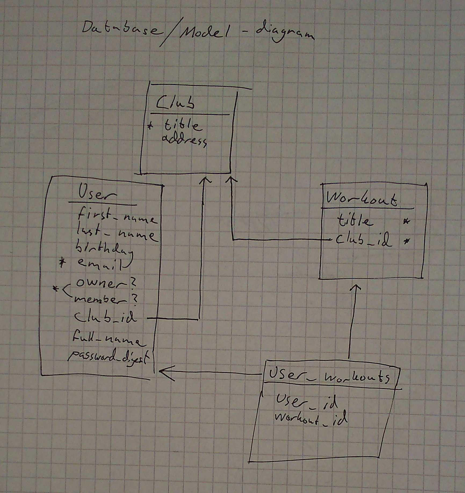

# RubyGyms

A gym membership database for 3 year olds.

## Running the tests

```bash
# it's the default rake task
rake
```

## Design decisions

### Database

SQLite; because it's portable and easy, no need for more at this point and it's
easy to change. I used this diagram as a sketch, it's not strictly a database
diagram but I think it shows my intentions.



### User roles

It's a simple boolean field, this obviously won't scale if you have more
roles, but YAGNI.

### Email validation

There is none, it's almost impossible to do this completely right, so
it is recommended to just send a confirmation email to verify.

### Testing

RSpec because it's well known and the industry standard.

I wrote tests where it made sense to test-drive the implementation, if you have
a bigger system or need more confidence you could spend more time on covering
everything, but in this small app I thought that would be a waste of time.

## TODO

Things I haven't had time for yet:

* Unique emails for users
* Confirmation emails
* Update password
* Better safety between roles
* Pagination and query optimization
* Check so you can't kick members from other clubs
* Get better test coverage
